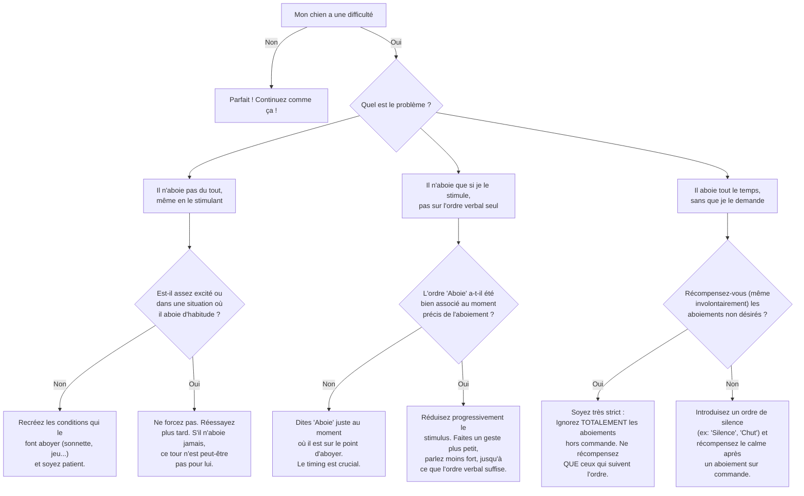

# Aboyer sur Commande

- **Description du Tour** : Ton chien aboie quand tu lui demandes.
- **Pourquoi l'Apprendre ?** : Un bon moyen de **contrôler** les aboiements intempestifs en lui donnant un exutoire sur commande.
- **Prérequis** : Aucun.

## Apprentissage Étape par Étape

### Niveau 1 : Dans le calme, sans distraction

1.  Attends que ton chien aboie **naturellement** (quand quelqu'un sonne, ou en jouant).
2.  Dès qu'il aboie, dis « **Bravo !** » et donne-lui une friandise.
3.  Juste avant qu'il n'aboie, introduis le mot « **Aboie** ».

### Niveau 2 : Avec de légères distractions

1.  Provoque un aboiement (en faisant un bruit qui l'excite, ou en tenant une friandise hors de sa portée) et dis « **Aboie** ».
2.  Récompense dès le **premier** aboiement.

### Niveau 3 : Avec des distractions modérées

1.  Demande « **Aboie** » sans le provoquer directement.
2.  Entraîne-toi avec de légères distractions autour.

### Niveau 4 : Dans des environnements variés

1.  Entraîne-toi dans différents endroits.
2.  Demande-lui plusieurs aboiements d'affilée.

## Arbre de Décision : Que faire si... ?

Voici un guide pour vous aider à résoudre les problèmes courants lors de l'apprentissage de ce tour.

- **Quand l'Exercice est-il Maîtrisé ?** : Ton chien aboie **immédiatement** et de manière **fiable** (9 fois sur 10) sur l'ordre « Aboie », sans provocation, dans des environnements variés et avec des distractions modérées.
- **Conseil du Coach** : Ne **jamais** récompenser les aboiements non sollicités. Sinon, tu risques d'encourager un comportement que tu cherches justement à contrôler. 
