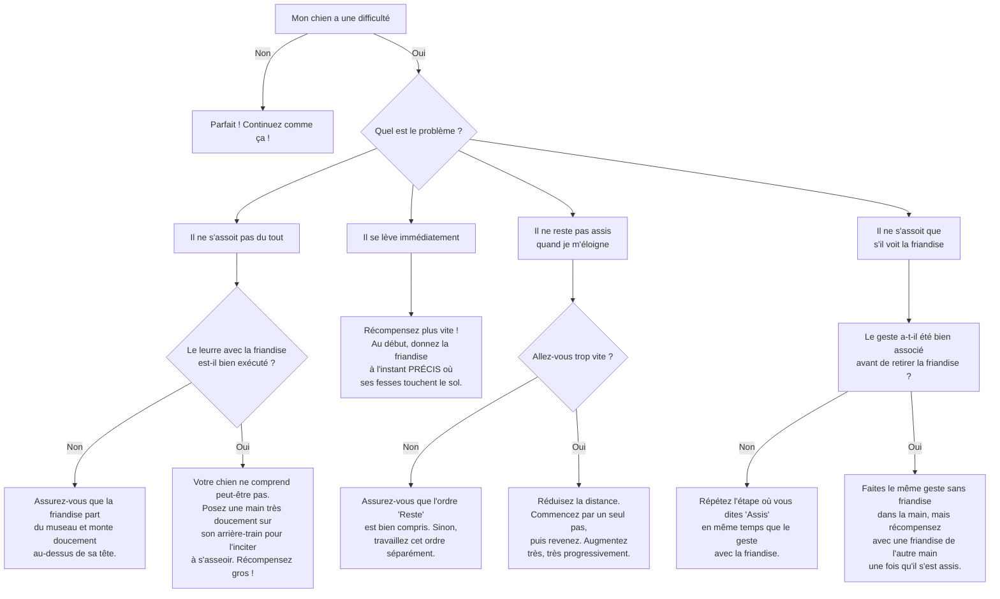

# L'ordre "Assis"

- **Description du Tour** : Le chien pose son arrière-train au sol, en gardant ses pattes avant droites.
- **Pourquoi l'Apprendre ?** : C'est une commande **fondamentale** pour le contrôle, la sécurité (attendre avant de traverser la rue), et la politesse (saluer sans sauter). Elle est souvent un prérequis pour d'autres tours.
- **Prérequis** : Aucun. C'est souvent le premier tour qu'on apprend.

## Apprentissage Étape par Étape

### Niveau 1 : Dans le calme, sans distraction

1.  Place-toi devant ton chien avec une **friandise** très appétissante.
2.  Amène lentement la friandise du museau de ton chien vers l'arrière de sa tête, au-dessus de son front. Il devrait naturellement baisser son arrière-train pour suivre la friandise et **s'asseoir**.
3.  Dès que ses fesses touchent le sol, dis « **Bravo !** » et donne la friandise.
4.  Répète l'exercice 5 à 10 fois par session courte.

### Niveau 2 : Avec de légères distractions

1.  Introduis le mot « **Assis** » juste avant de le guider avec la friandise.
2.  Demande-lui « Assis » alors que tu recules d'un pas.
3.  Demande-lui de rester assis 2-3 secondes avant de récompenser.
4.  Entraîne-toi dans une autre pièce calme de la maison.

### Niveau 3 : Avec des distractions modérées

1.  Augmente la distance à 3-5 pas.
2.  Augmente la durée à 5-10 secondes.
3.  Entraîne-toi avec une légère distraction (ex: télévision allumée, jouet au sol à distance).

### Niveau 4 : Dans des environnements variés

1.  Entraîne-toi dans le jardin, puis dans un parc peu fréquenté.
2.  Augmente progressivement la distance et la durée (jusqu'à 30 secondes ou plus).
3.  Introduis des distractions plus importantes (ex: un membre de la famille qui passe, un autre chien au loin).

## Arbre de Décision : Que faire si... ?

Voici un guide pour vous aider à résoudre les problèmes courants lors de l'apprentissage de ce tour.

- **Quand l'Exercice est-il Maîtrisé ?** : Ton chien s'assoit **immédiatement** et de manière **fiable** (9 sur 10 fois) sur l'ordre « Assis », quelle que soit la distance (jusqu'à 5-10 mètres), la durée (jusqu'à 30 secondes) et dans des environnements variés avec des distractions modérées. Le tout, sans avoir besoin de guide physique ou visuel.
- **Conseil du Coach** : Varie les récompenses pour maintenir sa **motivation**. S'il ne s'assoit pas, vérifie que la friandise est bien placée pour guider le mouvement. 
