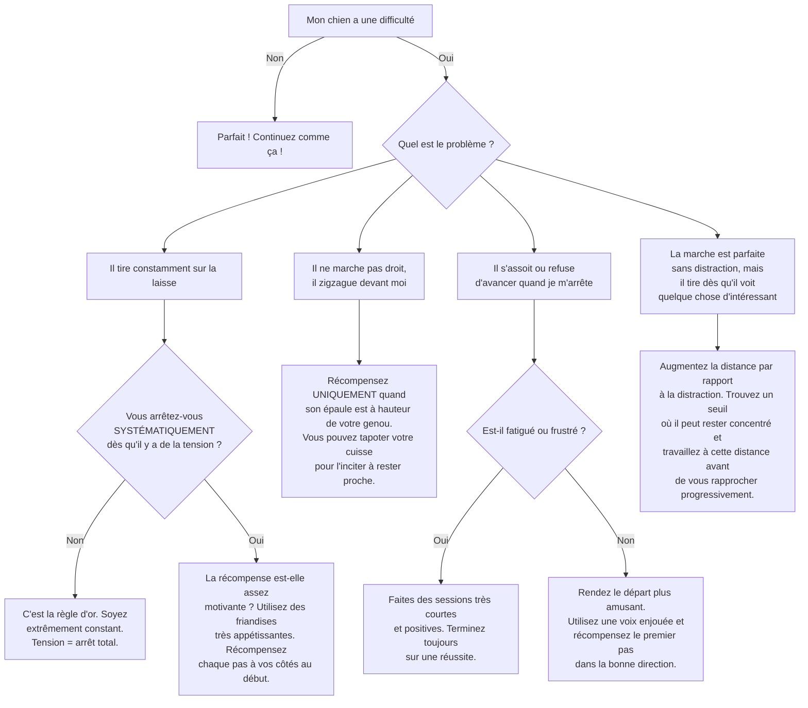

# La marche "Au Pied"

- **Description du Tour** : Ton chien marche calmement à côté de toi, sans tirer sur la laisse, avec son épaule à hauteur de ton genou.
- **Pourquoi l'Apprendre ?** : **Essentiel** pour des promenades agréables et sécuritaires. C'est aussi une marque de respect.
- **Prérequis** : Le chien doit être habitué au collier/harnais et à la laisse.

## Apprentissage Étape par Étape

### Niveau 1 : Dans le calme, sans distraction

1.  Utilise une laisse non extensible d'environ 1,5 à 2 mètres.
2.  Tiens la laisse **lâche**. Dès que ton chien se place à côté de ta jambe (choisis un côté, par exemple, le gauche), dis « **Bravo !** » et donne une friandise.
3.  Fais un pas. S'il reste à côté, « **Bravo !** » et friandise. S'il tire, **arrête-toi net**. Ne reprends que lorsque la laisse se détend.
4.  Entraîne-toi dans un lieu très calme, comme le salon ou le jardin.

### Niveau 2 : Avec de légères distractions

1.  Introduis l'ordre « **Au pied** » juste avant de commencer à marcher.
2.  Marche sur de courtes distances (quelques mètres) en récompensant souvent tant que la laisse est lâche.
3.  Entraîne-toi dans une autre pièce ou dans le jardin.

### Niveau 3 : Avec des distractions modérées

1.  Augmente la durée de la marche au pied (10-20 mètres).
2.  Entraîne-toi dans des environnements un peu plus stimulants (devant la maison, dans une rue calme).
3.  Introduis des **changements de direction** et de **rythme**.

### Niveau 4 : Dans des environnements variés

1.  Entraîne-toi dans des lieux très stimulants (parc, rue commerçante).
2.  Augmente la durée de la marche sur de plus longues périodes.
3.  Récompense de manière **aléatoire**, mais toujours pour une marche sans tension.

## Arbre de Décision : Que faire si... ?

Voici un guide pour vous aider à résoudre les problèmes courants lors de l'apprentissage de ce tour.

- **Quand l'Exercice est-il Maîtrisé ?** : Ton chien marche calmement à côté de toi, sans tirer, son épaule à hauteur de ton genou, de manière **fiable** (9 fois sur 10) dans des environnements variés et avec des distractions. Il s'arrête quand tu t'arrêtes.
- **Conseil du Coach** : Ne tire **jamais** sur la laisse pour le corriger. L'arrêt est la meilleure sanction. Ton chien doit comprendre que **tirer ne mène nulle part**. 
