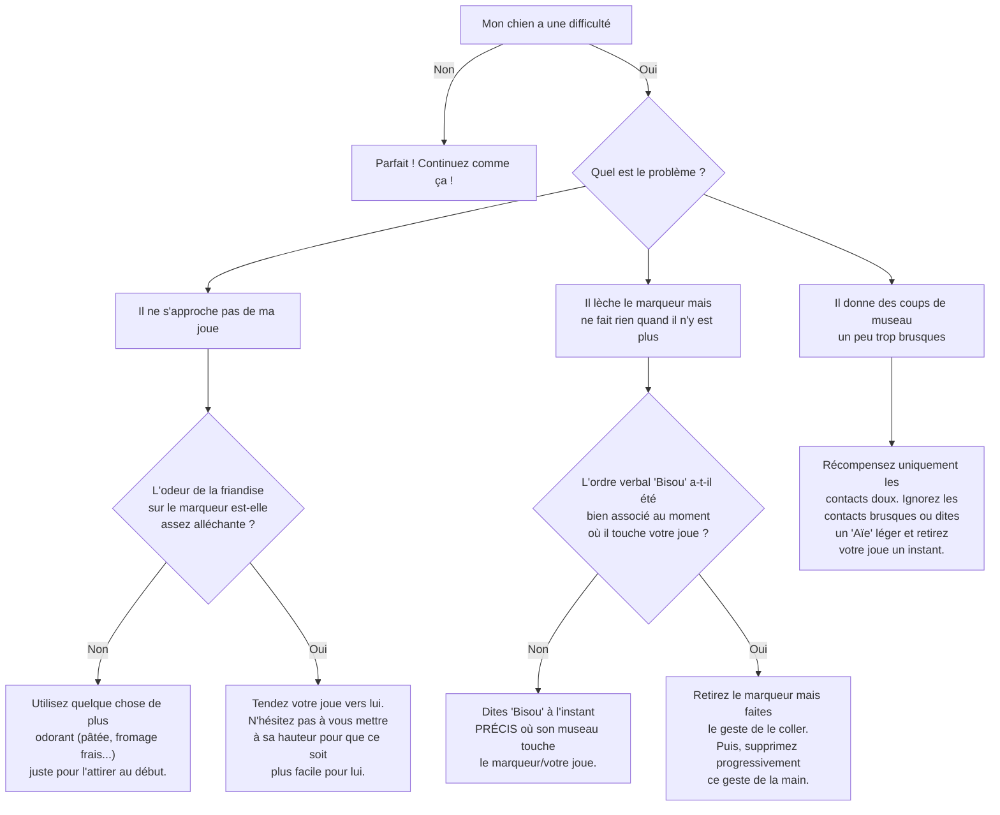

# Fais un "Bisou"

- **Description du Tour** : Ton chien pose son museau ou sa langue sur ta joue.
- **Pourquoi l'Apprendre ?** : Un tour adorable qui renforce votre **complicité**.
- **Prérequis** : Aucun.

## Apprentissage Étape par Étape

### Niveau 1 : Dans le calme, sans distraction

1.  Colle un post-it (ou un bout de scotch) avec une trace de friandise sur ta joue.
2.  Quand ton chien s'approche et lèche ou touche le post-it, dis « **Bravo !** » et donne-lui une friandise.
3.  Introduis le mot « **Bisou** » au moment où il touche.

### Niveau 2 : Avec de légères distractions

1.  Réduis la taille du post-it, puis retire-le juste avant qu'il ne t'embrasse.
2.  Entraîne-toi en te penchant légèrement vers lui.

### Niveau 3 : Avec des distractions modérées

1.  Demande le « **Bisou** » sans aucun support sur ta joue.
2.  Entraîne-toi avec de légères distractions.

### Niveau 4 : Dans des environnements variés

1.  Entraîne-toi dans différents endroits.
2.  Demande-lui le « **Bisou** » depuis différentes positions (assis, debout).

## Arbre de Décision : Que faire si... ?

Voici un guide pour vous aider à résoudre les problèmes courants lors de l'apprentissage de ce tour.

- **Quand l'Exercice est-il Maîtrisé ?** : Ton chien pose son museau ou lèche ta joue **immédiatement** et de manière **fiable** (9 fois sur 10) sur l'ordre « Bisou », sans aide, dans des environnements variés.
- **Conseil du Coach** : Si ton chien te lèche souvent naturellement, saisis l'occasion ! Au moment où il le fait, dis « **Bisou** » et récompense-le. Il associera le mot à son action. 
