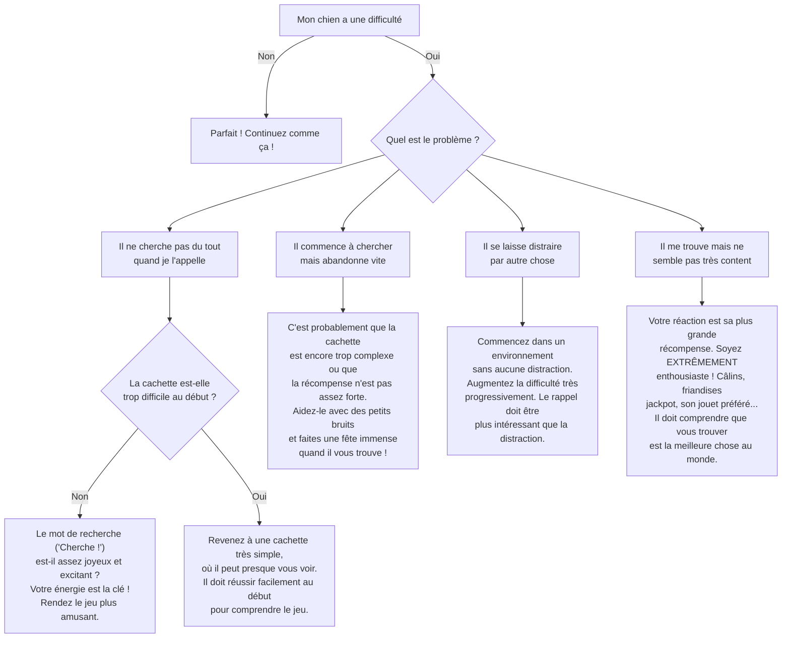

# Jouer à Cache-Cache

- **Description du Tour** : Tu te caches, et ton chien doit te trouver.
- **Pourquoi l'Apprendre ?** : Un jeu interactif qui renforce le **rappel**, stimule son **odorat** et son **écoute**. Et en plus, c'est très amusant !
- **Prérequis** : Maîtrise de l'ordre « **Rappel** ».

## Apprentissage Étape par Étape

### Niveau 1 : Dans le calme, sans distraction

1.  Dans une pièce, demande à ton chien de « **Rester** » ou fais-le tenir par quelqu'un.
2.  Cache-toi derrière un meuble ou une porte, pas trop loin.
3.  Appelle-le avec un mot joyeux : « **Cherche !** » ou « **Tu me trouves ?** ».
4.  Dès qu'il te trouve, félicite-le **bruyamment** (« OUIII, BRAVO ! ») et récompense-le généreusement.

### Niveau 2 : On augmente la difficulté

1.  Cache-toi dans une autre pièce.
2.  Augmente la distance et trouve des cachettes un peu plus difficiles.

### Niveau 3 : Avec des distractions modérées

1.  Cache-toi dans des endroits plus complexes (sous une couverture, derrière un rideau).
2.  Entraîne-toi avec de légères distractions (un autre membre de la famille présent dans la maison).

### Niveau 4 : Dans des environnements variés

1.  Passe au niveau supérieur : joue à l'extérieur (jardin clôturé, parc peu fréquenté).
2.  Augmente encore la difficulté des cachettes.

## Arbre de Décision : Que faire si... ?

Voici un guide pour vous aider à résoudre les problèmes courants lors de l'apprentissage de ce tour.

- **Quand l'Exercice est-il Maîtrisé ?** : Ton chien te trouve de manière **fiable** (9 fois sur 10) quand tu donnes l'ordre, même si la cachette est complexe et qu'il y a des distractions.
- **Conseil du Coach** : Rends le jeu **hyper excitant** et **gratifiant**. Ton énergie est la clé pour que ton chien adore ce jeu. 
