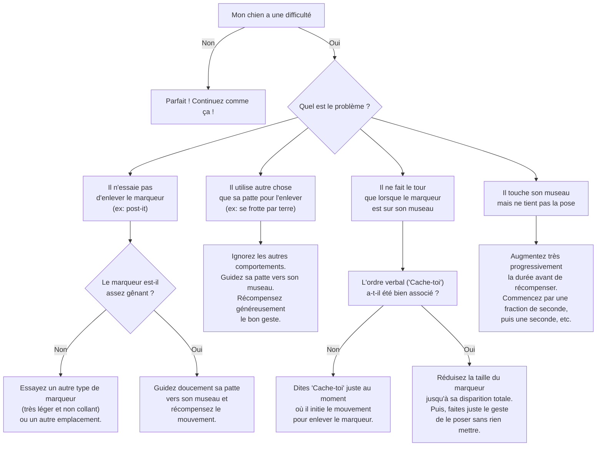

# "Cache-toi les yeux"

- **Description du Tour** : Ton chien pose une patte sur son museau ou ses yeux.
- **Pourquoi l'Apprendre ?** : Un tour **mignon** et amusant, qui demande de la dextérité.
- **Prérequis** : Maîtrise de l'ordre « **Donne la patte** ».

## Apprentissage Étape par Étape

### Niveau 1 : Dans le calme, sans distraction

1.  Colle un petit bout de ruban adhésif **très léger** (type post-it) sur son front ou son museau.
2.  Lorsqu'il essaie de l'enlever avec sa patte, dis « **Bravo !** » et récompense-le.
3.  Associe l'ordre « **Cache-toi** » à ce mouvement.

### Niveau 2 : On retire l'aide

1.  Retire le ruban adhésif et demande « **Cache-toi** ».
2.  Récompense dès qu'il fait le mouvement, même sans le ruban.

### Niveau 3 : On augmente la difficulté

1.  Demande-lui de tenir la pose de la patte un peu plus longtemps.
2.  Entraîne-toi avec de légères distractions.

### Niveau 4 : Dans des environnements variés

1.  Entraîne-toi dans différents endroits.
2.  Demande-lui le tour à distance.

## Arbre de Décision : Que faire si... ?

Voici un guide pour vous aider à résoudre les problèmes courants lors de l'apprentissage de ce tour.

- **Quand l'Exercice est-il Maîtrisé ?** : Ton chien pose sa patte sur son museau/yeux **immédiatement** et de manière **fiable** (9 fois sur 10) sur l'ordre « Cache-toi », sans aide, et maintient la position quelques secondes, même avec des distractions.
- **Conseil du Coach** : Fais bien attention à utiliser un ruban adhésif qui ne colle pas et n'irrite pas sa peau. Le but est de le **gêner** un tout petit peu, pas de lui faire mal. 
