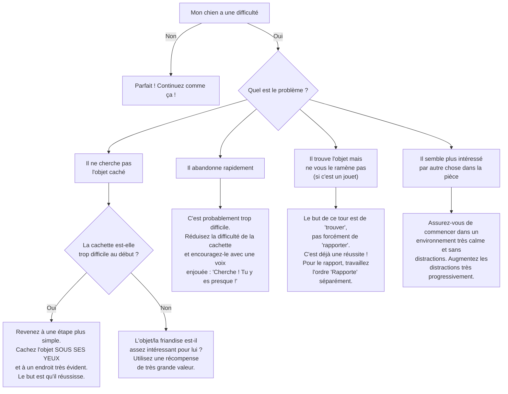

# L'ordre "Cherche"

- **Description du Tour** : Ton chien utilise son flair pour trouver une friandise ou un jouet que tu as caché.
- **Pourquoi l'Apprendre ?** : C'est une stimulation **énorme** pour son odorat. Excellent pour le fatiguer mentalement et lui apprendre à résoudre des problèmes.
- **Prérequis** : Aucun.

## Apprentissage Étape par Étape

### Niveau 1 : Dans le calme, sous ses yeux

1.  Montre une **friandise** à ton chien.
2.  Cache-la à un endroit **très facile** (sous un verre, sous un coussin) juste devant lui.
3.  Dis « **Cherche !** » et encourage-le.
4.  Dès qu'il trouve, dis « **Bravo !** » et laisse-le manger.

### Niveau 2 : On complique un peu

1.  Cache la friandise sans qu'il te voie, mais reste dans la même pièce.
2.  Augmente un peu la difficulté des cachettes.

### Niveau 3 : On change de pièce

1.  Cache la friandise dans une autre pièce.
2.  Augmente la difficulté (sous un tapis, derrière un meuble).
3.  Entraîne-toi avec de légères distractions.

### Niveau 4 : On passe à l'extérieur

1.  Cache des friandises dans des endroits variés (jardin, parc).
2.  Augmente la complexité des cachettes.
3.  Utilise des tapis de fouille ou des jouets distributeurs pour varier.

## Arbre de Décision : Que faire si... ?

Voici un guide pour vous aider à résoudre les problèmes courants lors de l'apprentissage de ce tour.

- **Quand l'Exercice est-il Maîtrisé ?** : Ton chien trouve l'objet caché de manière **fiable** (9 fois sur 10) sur l'ordre « Cherche », même si la cachette est complexe et dans un environnement avec des distractions.
- **Conseil du Coach** : Commence **toujours** par des cachettes très faciles. Il doit d'abord comprendre le jeu. Si c'est trop dur au début, il va juste se frustrer et abandonner. 
