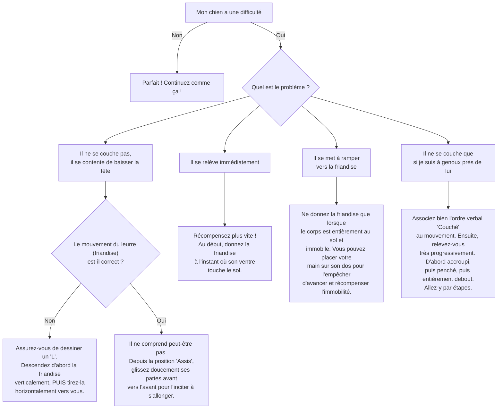

# L'ordre "Couché"

- **Description du Tour** : Ton chien s'allonge complètement sur le ventre, avec les pattes étendues.
- **Pourquoi l'Apprendre ?** : Très utile pour le **calme**, la gestion des invités, et c'est la base de tours plus complexes comme « Fais le mort » ou « Rampe ».
- **Prérequis** : Maîtrise de l'ordre « **Assis** ».

## Apprentissage Étape par Étape

### Niveau 1 : Dans le calme, sans distraction

1.  Demande à ton chien de s'asseoir.
2.  Tiens une **friandise** devant son museau. Abaisse-la lentement vers le sol, puis tire-la vers l'avant (entre ses pattes), comme pour dessiner un "L".
3.  Ton chien devrait suivre la friandise et **s'allonger**. Dès qu'il est couché, dis « **Bravo !** » et donne-lui la friandise.
4.  Répète 5 à 10 fois par session.

### Niveau 2 : Avec de légères distractions

1.  Introduis le mot « **Couché** » juste avant de le guider avec la friandise.
2.  Demande-lui « Couché » alors que tu es debout, à côté de lui.
3.  Demande-lui de rester couché 2-3 secondes avant de le récompenser.
4.  Entraîne-toi dans une autre pièce calme.

### Niveau 3 : Avec des distractions modérées

1.  Augmente la distance à 3-5 pas.
2.  Augmente la durée à 5-10 secondes.
3.  Entraîne-toi avec une légère distraction (une musique douce, par exemple).

### Niveau 4 : Dans des environnements variés

1.  Entraîne-toi dans le jardin, puis dans un parc avec des bruits de fond.
2.  Augmente progressivement la distance et la durée (jusqu'à 30 secondes et plus).
3.  Introduis des distractions plus importantes (un jouet qui roule au loin).

## Arbre de Décision : Que faire si... ?

Voici un guide pour vous aider à résoudre les problèmes courants lors de l'apprentissage de ce tour.

- **Quand l'Exercice est-il Maîtrisé ?** : Ton chien s'allonge **immédiatement** et de manière **fiable** (9 fois sur 10) sur l'ordre « Couché », peu importe la distance (jusqu'à 10 mètres), la durée, et dans des environnements variés, sans que tu aies besoin de le guider.
- **Conseil du Coach** : S'il se relève, pas de panique, et surtout, **ne le gronde pas**. Ramène-le simplement à l'étape d'avant et assure-toi que ton geste avec la friandise est bien clair. 
