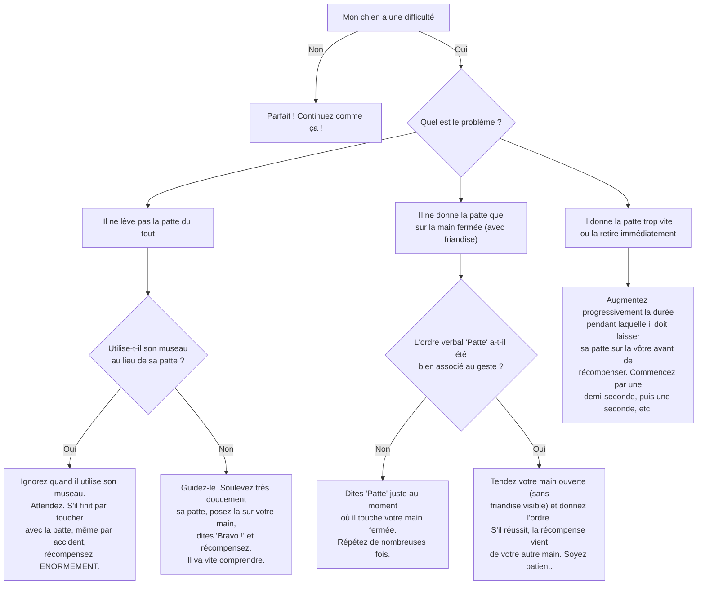

# "Donne la Patte"

- **Description du Tour** : Ton chien lève une de ses pattes avant et la pose dans ta main.
- **Pourquoi l'Apprendre ?** : Un grand **classique** qui renforce votre complicité et la coordination de ton chien.
- **Prérequis** : Maîtrise de l'ordre « **Assis** ».

## Apprentissage Étape par Étape

### Niveau 1 : Dans le calme, sans distraction

1.  Demande à ton chien de s'asseoir.
2.  Tiens une **friandise** dans ta main fermée. Présente ton poing à ton chien. Il va sûrement essayer de l'ouvrir avec son museau ou sa patte.
3.  Dès qu'il touche ta main avec sa **patte**, dis « **Bravo !** » et ouvre ta main pour lui donner la friandise.
4.  Répète plusieurs fois.

### Niveau 2 : On introduit l'ordre

1.  Introduis le mot « **Patte** » (ou « Donne la patte ») juste avant qu'il ne touche ta main.
2.  Augmente un peu le temps où il laisse sa patte sur ta main avant de récompenser.
3.  Entraîne-toi dans une autre pièce.

### Niveau 3 : On retire l'aide

1.  Maintenant, tends ta main **ouverte** (paume vers le haut) au lieu de la fermer.
2.  Augmente la distance à laquelle tu tends la main.
3.  Entraîne-toi avec de légères distractions.

### Niveau 4 : Dans des environnements variés

1.  Entraîne-toi dans différents endroits.
2.  Demande la patte sans avoir de friandise visible dans la main (donne-la juste après).
3.  Introduis des distractions plus importantes.

## Arbre de Décision : Que faire si... ?

Voici un guide pour vous aider à résoudre les problèmes courants lors de l'apprentissage de ce tour.

- **Quand l'Exercice est-il Maîtrisé ?** : Ton chien lève sa patte et la pose dans ta main **immédiatement** et de manière **fiable** (9 fois sur 10) sur l'ordre « Patte », sans aide, dans des environnements variés.
- **Conseil du Coach** : S'il ne lève pas la patte, ne t'inquiète pas. Tu peux **doucement** la soulever toi-même en donnant l'ordre, puis récompenser. Il va vite comprendre le geste. 
