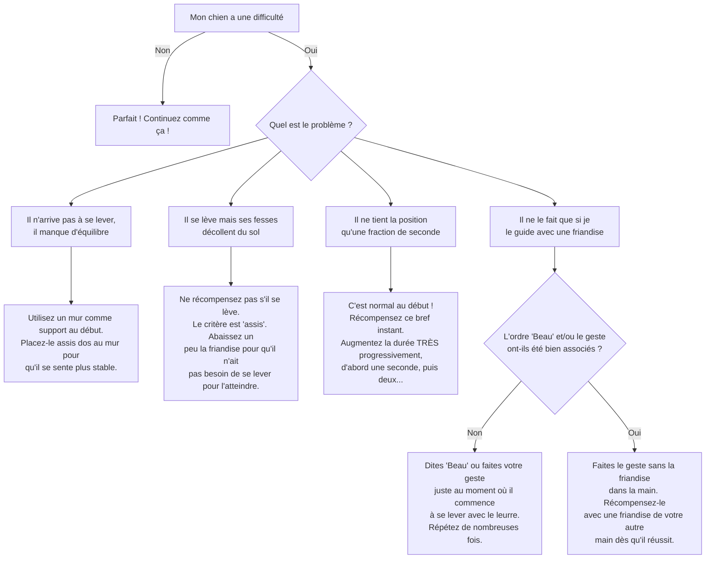

# "Fais le Beau"

- **Description du Tour** : Ton chien est assis sur son arrière-train et lève ses deux pattes avant, comme s'il priait.
- **Pourquoi l'Apprendre ?** : Un tour **impressionnant** et amusant qui sollicite son **équilibre** et ses **muscles**.
- **Prérequis** : Maîtrise de l'ordre « **Assis** ».

## Apprentissage Étape par Étape

### Niveau 1 : Avec un support

1.  Demande à ton chien de s'asseoir, de préférence près d'un **mur** pour le soutenir.
2.  Tiens une **friandise** au-dessus de son museau et lève-la doucement vers le haut et un peu en arrière.
3.  Il devrait lever ses pattes avant pour l'atteindre. Dès qu'il se redresse un peu, dis « **Bravo !** » et donne la friandise.
4.  **Important** : ne récompense que s'il garde les fesses au sol.

### Niveau 2 : Sans support

1.  Introduis le mot « **Beau** » juste avant de le guider avec la friandise.
2.  Demande-lui de faire le beau **sans l'aide du mur**.
3.  Exige qu'il maintienne la position 1 à 2 secondes.

### Niveau 3 : On augmente la durée

1.  Augmente la durée de la position (3-5 secondes).
2.  Réduis le guidage avec la friandise, en utilisant juste un geste de la main.
3.  Entraîne-toi avec de légères distractions.

### Niveau 4 : Dans des environnements variés

1.  Entraîne-toi dans différents endroits.
2.  Augmente la durée jusqu'à 10 secondes ou plus.
3.  Introduis des distractions plus importantes.

## Arbre de Décision : Que faire si... ?

Voici un guide pour vous aider à résoudre les problèmes courants lors de l'apprentissage de ce tour.

- **Quand l'Exercice est-il Maîtrisé ?** : Ton chien se met en position « Fais le beau » **immédiatement** et de manière **fiable** (9 fois sur 10), sur ordre verbal ou gestuel, et tient la position plusieurs secondes, même avec des distractions.
- **Conseil du Coach** : **Attention au dos de ton chien**. Ce tour sollicite beaucoup son corps. N'en abuse pas, surtout s'il est de grande taille ou a des fragilités. La santé avant tout. 
