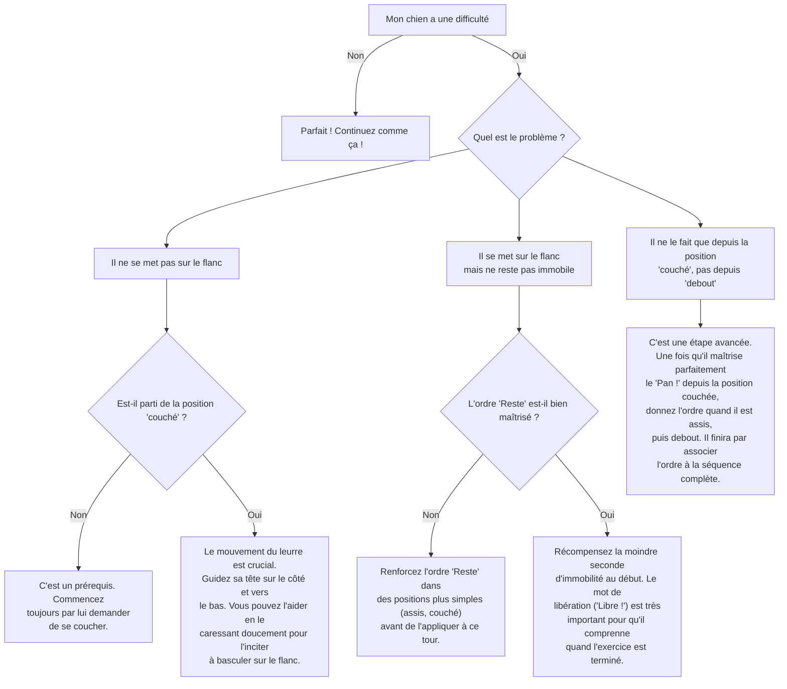

# "Fais le Mort"

- **Description du Tour** : Ton chien s'allonge sur le flanc et reste immobile, comme s'il était KO.
- **Pourquoi l'Apprendre ?** : Un tour **spectaculaire** qui impressionne et demande une excellente **maîtrise de soi** à ton chien.
- **Prérequis** : Maîtrise des ordres « **Couché** » et « **Reste** ».

## Apprentissage Étape par Étape

### Niveau 1 : Le guidage

1.  Demande à ton chien de se coucher.
2.  Tiens une **friandise** près de son museau et guide-le pour qu'il se mette sur le flanc, en posant sa tête au sol.
3.  Dès qu'il est sur le flanc, tête au sol, dis « **Bravo !** » et donne la friandise.

### Niveau 2 : L'ordre et le geste

1.  Introduis le mot « **Pan !** » ou « Fais le mort » et un geste (pointe ton doigt comme un pistolet) juste avant de le guider.
2.  Exige qu'il reste sur le flanc 2-3 secondes avant de récompenser, en utilisant l'ordre « **Reste** ».

### Niveau 3 : On augmente la difficulté

1.  Augmente la durée (5-10 secondes) et la distance à laquelle tu donnes l'ordre.
2.  Réduis progressivement le guidage avec la friandise.
3.  Entraîne-toi à le faire depuis la position assise, puis debout.

### Niveau 4 : Dans des environnements variés

1.  Entraîne-toi dans différents endroits.
2.  Augmente la durée de la position (jusqu'à 30 secondes ou plus).
3.  Introduis des distractions plus importantes.

## Arbre de Décision : Que faire si... ?

Voici un guide pour vous aider à résoudre les problèmes courants lors de l'apprentissage de ce tour.

- **Quand l'Exercice est-il Maîtrisé ?** : Ton chien se met en position **immédiatement** et de manière **fiable** (9 fois sur 10) sur l'ordre verbal et/ou le geste, sans guidage, depuis n'importe quelle position (assis, debout), et reste immobile même avec des distractions.
- **Conseil du Coach** : Sois **généreux** sur la récompense quand il réussit parfaitement. Il doit comprendre que ce "grand final" vaut vraiment le coup. 
