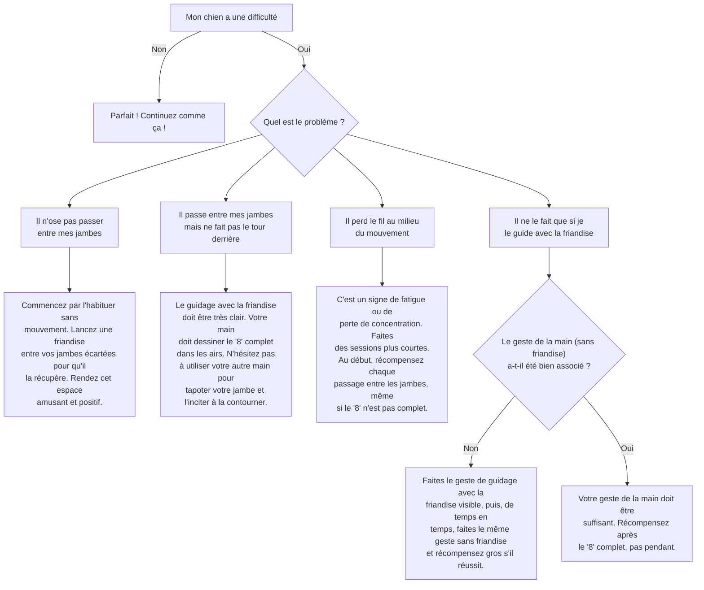

# Le "Huit" entre les jambes

- **Description du Tour** : Ton chien passe en formant un "8" entre tes jambes, pendant que tu restes immobile.
- **Pourquoi l'Apprendre ?** : Un tour **élégant** qui améliore sa **coordination** et sa **concentration** autour de toi.
- **Prérequis** : Ton chien doit être à l'aise à l'idée de passer entre tes jambes.

## Apprentissage Étape par Étape

### Niveau 1 : Le guidage

1.  Tiens une **friandise** dans ta main. Place ton chien devant toi.
2.  Avance une jambe (la droite, par exemple) et guide ton chien avec la friandise pour qu'il passe entre tes jambes et ressorte de l'autre côté.
3.  Dès qu'il est passé, dis « **Bravo !** » et donne-lui la friandise.
4.  Guide-le ensuite pour qu'il fasse le tour de ta jambe gauche et repasse entre tes jambes dans l'autre sens, pour former un "8".

### Niveau 2 : On introduit l'ordre

1.  Introduis le mot « **Huit** » ou « Autour ».
2.  Réduis le guidage avec la friandise, en utilisant juste un geste de la main.
3.  Fais un "huit" complet.

### Niveau 3 : On enchaîne

1.  Augmente le nombre de "huits" à la suite.
2.  Entraîne-toi avec de légères distractions.

### Niveau 4 : On fluidifie

1.  Entraîne-toi dans différents endroits.
2.  Augmente la **fluidité** et la **vitesse** du mouvement.

## Arbre de Décision : Que faire si... ?

Voici un guide pour vous aider à résoudre les problèmes courants lors de l'apprentissage de ce tour.

- **Quand l'Exercice est-il Maîtrisé ?** : Ton chien exécute le "8" de manière **fluide** et **fiable** (9 fois sur 10) entre tes jambes (immobiles ou en mouvement très lent), sur ordre verbal ou gestuel, sans guidage, même avec des distractions.
- **Conseil du Coach** : Ce tour est une excellente base pour l'obérythmée (le "dog dancing"). Si ça t'intéresse, c'est un super point de départ. 
