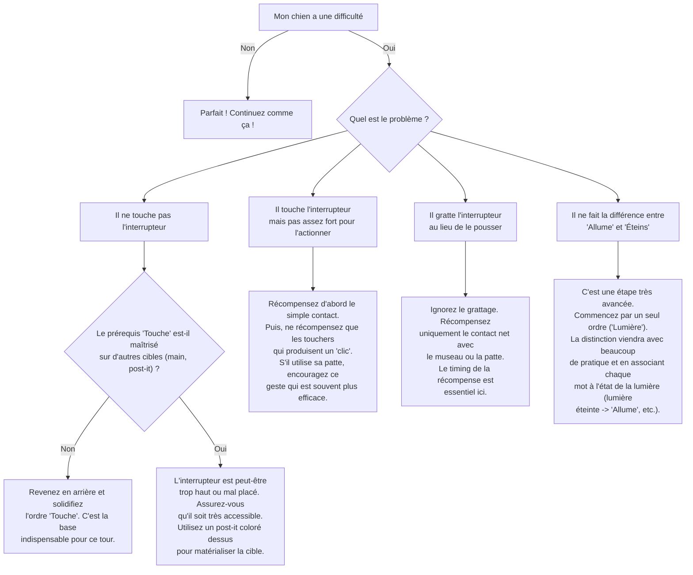

# Allumer et Éteindre la Lumière

- **Description du Tour** : Ton chien touche un interrupteur avec son museau ou sa patte pour allumer ou éteindre la lumière.
- **Pourquoi l'Apprendre ?** : Un tour **bluffant** qui montre l'intelligence de ton chien et qui peut même être utile !
- **Prérequis** : Maîtrise de l'ordre « **Touche** » (avec le museau ou la patte).

## Apprentissage Étape par Étape

### Niveau 1 : Le contact

1.  Colle une **friandise** (ou un post-it avec une odeur de friandise) sur l'interrupteur.
2.  Dis « **Lumière** » (ou « On/Off »).
3.  Dès que ton chien touche l'interrupteur avec son museau ou sa patte pour la récupérer, dis « **Bravo !** » et donne-lui une vraie friandise.

### Niveau 2 : On retire l'aide

1.  Retire la friandise de l'interrupteur, mais récompense dès qu'il le touche.
2.  Introduis les mots « **Allume** » ou « **Éteins** ».

### Niveau 3 : On prend de la distance

1.  Augmente la distance à laquelle tu donnes l'ordre.
2.  Entraîne-toi avec de légères distractions.

### Niveau 4 : On généralise

1.  Entraîne-toi avec différents interrupteurs dans la maison.
2.  Demande-lui le tour à distance.

## Arbre de Décision : Que faire si... ?

Voici un guide pour vous aider à résoudre les problèmes courants lors de l'apprentissage de ce tour.

- **Quand l'Exercice est-il Maîtrisé ?** : Ton chien touche l'interrupteur **immédiatement** et de manière **fiable** (9 fois sur 10) sur l'ordre verbal ou gestuel, sans guidage, dans des environnements variés et avec des distractions.
- **Conseil du Coach** : Vérifie bien que l'interrupteur est à une hauteur **accessible** et **sécuritaire** pour ton chien. Ne le mets pas en difficulté. 
