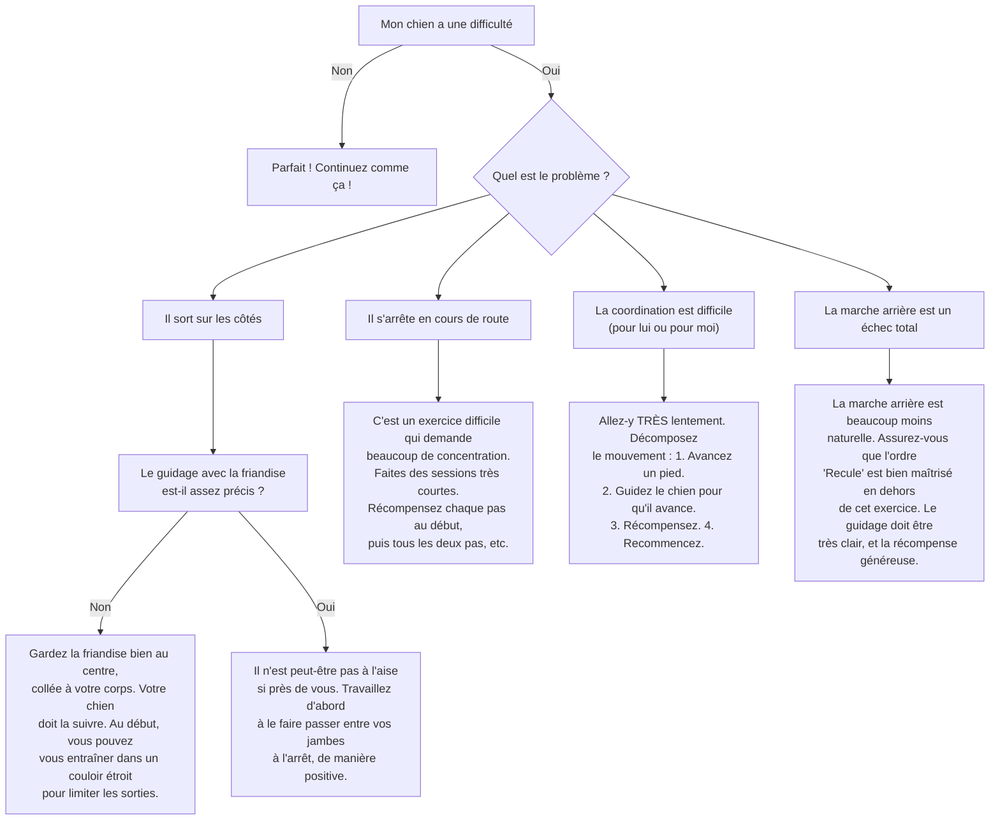

# La Marche "Militaire" (entre les jambes)

- **Description du Tour** : Ton chien marche en avant ou en arrière entre tes jambes, en rythme avec toi.
- **Pourquoi l'Apprendre ?** : Un tour **très impressionnant** qui demande une super **coordination** et **concentration**. Renforce le lien en mouvement.
- **Prérequis** : Maîtrise des ordres « **Recule** » et « **Au pied** ».

## Apprentissage Étape par Étape

### Niveau 1 : Le guidage, pas à pas

1.  Tiens une **friandise**. Place ton chien entre tes jambes, face à toi.
2.  Dis « **Marche** » et avance un pied. Guide ton chien avec la friandise pour qu'il avance avec toi.
3.  Dès qu'il fait un pas, dis « **Bravo !** » et donne la friandise.
4.  **Pour la marche arrière** : place-le entre tes jambes, tourné vers l'arrière. Dis « **Recule** » et recule d'un pas, en le guidant.

### Niveau 2 : On introduit l'ordre

1.  Introduis les ordres « **Marche entre** » ou « **Recule entre** ».
2.  Fais quelques pas en avant ou en arrière.

### Niveau 3 : On enchaîne

1.  Augmente le nombre de pas.
2.  Entraîne-toi avec de légères distractions.

### Niveau 4 : On fluidifie

1.  Entraîne-toi dans différents endroits.
2.  Augmente la distance et la **fluidité** du mouvement.

## Arbre de Décision : Que faire si... ?

Voici un guide pour vous aider à résoudre les problèmes courants lors de l'apprentissage de ce tour.

- **Quand l'Exercice est-il Maîtrisé ?** : Ton chien marche en avant ou en arrière entre tes jambes de manière **fluide** et **fiable** (9 fois sur 10), sur ordre verbal ou gestuel, sans guidage, sur plusieurs mètres et même avec des distractions.
- **Conseil du Coach** : La **patience** est la clé. Ce tour demande une énorme coordination pour ton chien (et pour toi !). Allez-y pas à pas. 
