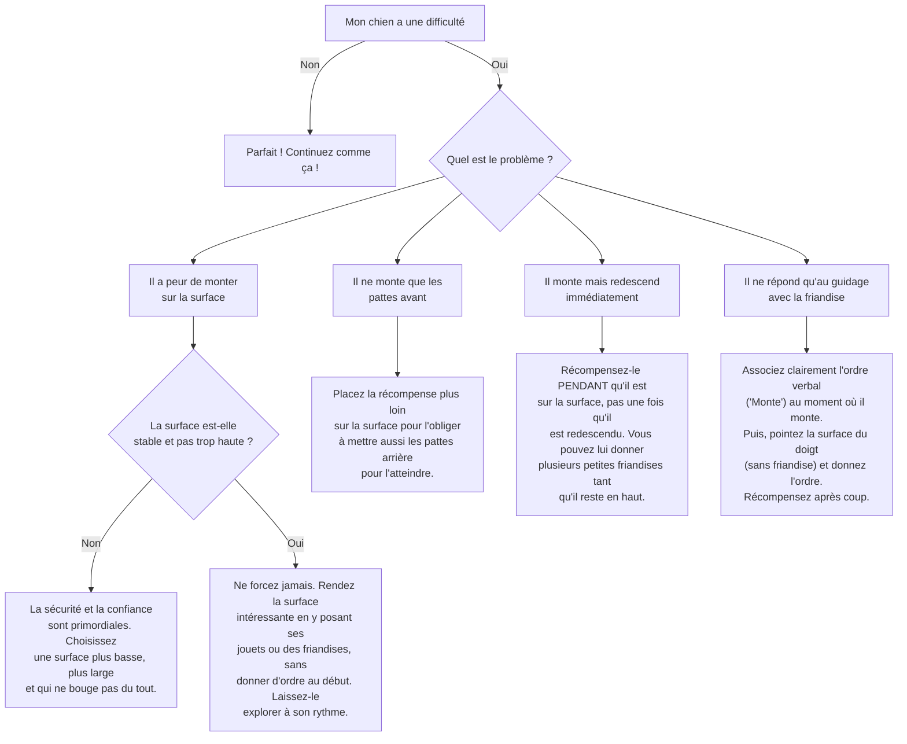

# "Monte" et "Descend" (Commandes Pratiques)

- **Description du Tour** : Ton chien monte ou descend d'une surface (voiture, canapé, etc.) quand tu le lui demandes.
- **Pourquoi l'Apprendre ?** : **Très utile** au quotidien : monter en voiture, sur la table du vétérinaire, sur une balance...
- **Prérequis** : Aucun.

## Apprentissage Étape par Étape

### Niveau 1 : Le guidage facile

1.  Place une **friandise** sur une surface basse (un gros coussin, une marche d'escalier).
2.  Dis « **Monte** » et incite ton chien à monter pour la récupérer.
3.  Dès qu'il monte, dis « **Bravo !** » et donne la friandise.
4.  Pour « **Descend** », mets une friandise par terre et incite-le à descendre.

### Niveau 2 : On introduit l'ordre

1.  Introduis le mot « **Monte** » ou « **Descend** » juste avant le mouvement.
2.  Utilise des surfaces un peu plus hautes.

### Niveau 3 : On varie les surfaces

1.  Varie les objets : un banc, une chaise solide...
2.  Entraîne-toi avec de légères distractions.

### Niveau 4 : On généralise

1.  Entraîne-toi dans des contextes utiles (le coffre de la voiture, la table d'examen du véto).
2.  Demande-lui le tour à distance.

## Arbre de Décision : Que faire si... ?

Voici un guide pour vous aider à résoudre les problèmes courants lors de l'apprentissage de ce tour.

- **Quand l'Exercice est-il Maîtrisé ?** : Ton chien monte ou descend de n'importe quelle surface **immédiatement** et de manière **fiable** (9 fois sur 10) sur ordre, sans guidage, même avec des distractions.
- **Conseil du Coach** : La **sécurité d'abord**. Assure-toi **toujours** que la surface est stable et pas trop haute pour lui. Ne le mets jamais en danger. 
