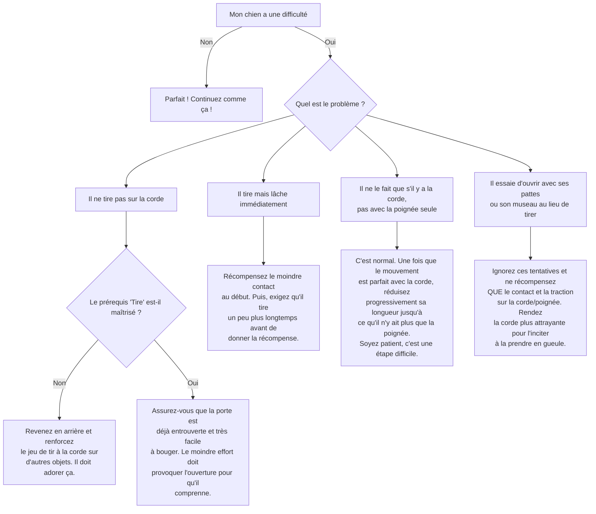

# "Ouvre" la porte ou un tiroir

- **Description du Tour** : Ton chien ouvre une porte ou un tiroir en tirant sur une poignée ou une corde.
- **Pourquoi l'Apprendre ?** : Un tour **impressionnant** et utile pour t'aider à la maison.
- **Prérequis** : Maîtrise de « **Touche** » et « **Tire** ».

## Apprentissage Étape par Étape

### Niveau 1 : Le guidage avec aide

1.  Attache une **cordelette** à la poignée d'un tiroir ou d'une porte déjà un peu ouverte.
2.  Tiens une **friandise** de l'autre côté.
3.  Dis « **Ouvre** » et incite ton chien à tirer sur la cordelette pour avoir la friandise.
4.  Dès qu'il tire et que ça s'ouvre, dis « **Bravo !** » et donne-lui la friandise.

### Niveau 2 : On retire l'aide

1.  Introduis le mot « **Ouvre** ».
2.  Réduis le guidage avec la friandise.

### Niveau 3 : Sans la corde

1.  Demande-lui d'ouvrir sans la cordelette (si la poignée est facile à attraper).
2.  Entraîne-toi avec de légères distractions.

### Niveau 4 : On généralise

1.  Entraîne-toi avec différentes portes ou tiroirs.
2.  Demande-lui le tour à distance.

## Arbre de Décision : Que faire si... ?

Voici un guide pour vous aider à résoudre les problèmes courants lors de l'apprentissage de ce tour.

- **Quand l'Exercice est-il Maîtrisé ?** : Ton chien ouvre la porte ou le tiroir désigné **immédiatement** et de manière **fiable** (9 fois sur 10) sur l'ordre « Ouvre », sans guidage, même avec des distractions.
- **Conseil du Coach** : Commence avec des portes ou des tiroirs **très faciles** à ouvrir. Le but est qu'il réussisse vite pour qu'il ait envie de continuer. 
