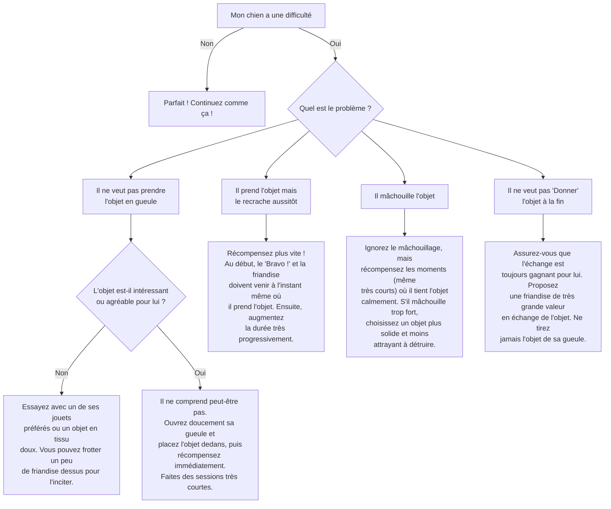

# L'ordre "Porte"

- **Description du Tour** : Ton chien prend un objet dans sa gueule et le tient jusqu'à ce que tu dises "Donne".
- **Pourquoi l'Apprendre ?** : Super utile pour **rapporter** des objets, pour jouer, ou comme base pour des tours plus complexes (comme ranger ses jouets).
- **Prérequis** : Ton chien doit être à l'aise avec le fait de tenir des objets dans sa gueule.

## Apprentissage Étape par Étape

### Niveau 1 : Le premier contact

1.  Présente un objet **léger** et **intéressant** à ton chien.
2.  Dès qu'il le prend dans sa gueule, dis « **Bravo !** » et donne une friandise.
3.  Introduis le mot « **Porte** ».

### Niveau 2 : On tient un peu

1.  Demande « **Porte** » et récompense-le s'il tient l'objet 1 à 2 secondes.
2.  Augmente progressivement la durée.

### Niveau 3 : On tient plus longtemps

1.  Augmente la durée à 5-10 secondes.
2.  Entraîne-toi avec de légères distractions.
3.  Varie les objets à porter.

### Niveau 4 : On bouge avec

1.  Entraîne-toi dans différents endroits.
2.  Demande à ton chien de porter l'objet tout en marchant à côté de toi.

## Arbre de Décision : Que faire si... ?

Voici un guide pour vous aider à résoudre les problèmes courants lors de l'apprentissage de ce tour.

- **Quand l'Exercice est-il Maîtrisé ?** : Ton chien prend l'objet désigné et le tient **fiablement** (9 fois sur 10) sur l'ordre verbal ou gestuel, pendant plusieurs secondes, même avec des distractions.
- **Conseil du Coach** : La **sécurité** avant tout. Assure-toi que l'objet est sûr et qu'il ne risque pas de l'avaler. Choisis des objets adaptés à sa taille. 
