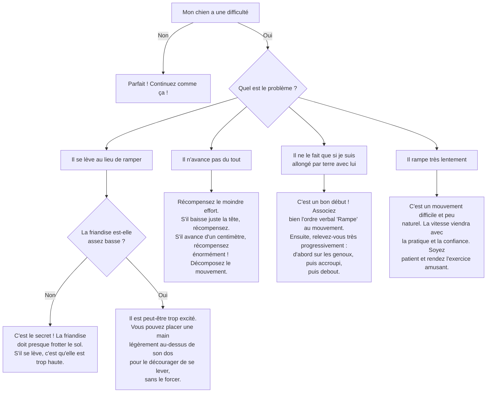

# L'ordre "Rampe"

- **Description du Tour** : Ton chien se déplace en rampant, le ventre collé au sol.
- **Pourquoi l'Apprendre ?** : Un tour **impressionnant** qui sollicite ses **muscles** et sa **concentration**.
- **Prérequis** : Maîtrise de l'ordre « **Couché** ».

## Apprentissage Étape par Étape

### Niveau 1 : Le guidage au sol

1.  Demande à ton chien de se coucher.
2.  Tiens une **friandise** très près du sol, juste devant son museau.
3.  Tire **lentement** la friandise vers l'avant, pour l'inciter à avancer en rampant pour l'avoir.
4.  Dès qu'il fait le moindre petit mouvement de rampe, dis « **Bravo !** » et donne-lui la friandise.

### Niveau 2 : On introduit l'ordre

1.  Introduis le mot « **Rampe** » juste avant de le guider avec la friandise.
2.  Augmente la distance de rampe à quelques centimètres.
3.  Entraîne-toi dans une autre pièce.

### Niveau 3 : On prend de la distance

1.  Augmente la distance de rampe (1-2 mètres).
2.  Réduis le guidage avec la friandise, en utilisant juste un geste de la main.
3.  Entraîne-toi avec de légères distractions.

### Niveau 4 : On généralise

1.  Entraîne-toi dans différents endroits.
2.  Augmente la distance de rampe sur plusieurs mètres.
3.  Introduis des distractions plus importantes.

## Arbre de Décision : Que faire si... ?

Voici un guide pour vous aider à résoudre les problèmes courants lors de l'apprentissage de ce tour.

- **Quand l'Exercice est-il Maîtrisé ?** : Ton chien rampe de manière **fluide** et **fiable** (9 fois sur 10) sur ordre verbal ou gestuel, sans guidage, sur plusieurs mètres, même avec des distractions.
- **Conseil du Coach** : Si ton chien se lève, ce n'est pas grave. Reprends simplement l'étape d'avant. Le secret, c'est de garder la friandise **très, très basse**. 
