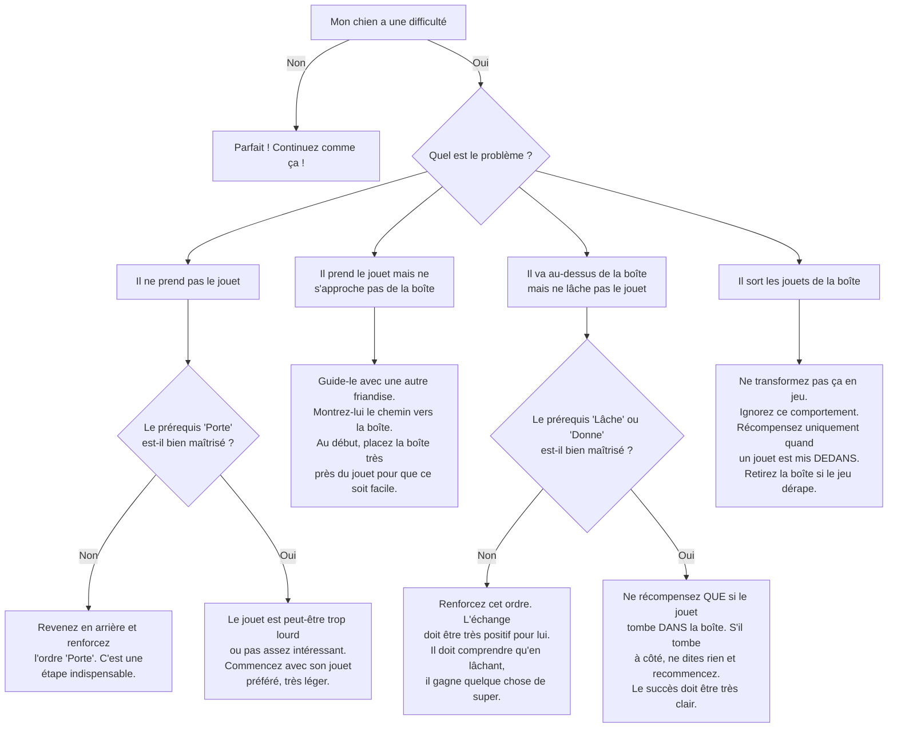

# "Range tes Jouets"

- **Description du Tour** : Ton chien prend ses jouets un par un et les met dans une boîte ou un panier.
- **Pourquoi l'Apprendre ?** : Un tour **très pratique** qui stimule sa **réflexion** et aide à garder la maison en ordre !
- **Prérequis** : Maîtrise des ordres « **Porte** » et « **Lâche** » (ou « Donne »).

## Apprentissage Étape par Étape

### Niveau 1 : Le premier jouet

1.  Place un jouet près d'une boîte vide.
2.  Demande à ton chien de « **Porter** » le jouet.
3.  Une fois qu'il l'a en gueule, guide-le vers la boîte.
4.  Dès qu'il est au-dessus de la boîte, dis « **Lâche** » (ou « Donne ») et récompense-le **uniquement** si le jouet tombe dedans.

### Niveau 2 : On introduit l'ordre

1.  Introduis l'ordre « **Range** » ou « Dans la boîte ».
2.  Augmente un peu la distance entre le jouet et la boîte.

### Niveau 3 : Plusieurs jouets

1.  Mets plusieurs jouets par terre à ranger.
2.  Entraîne-toi avec de légères distractions.

### Niveau 4 : Le grand rangement

1.  Entraîne-toi dans différentes pièces.
2.  Demande-lui de ranger des jouets qui sont plus loin.

## Arbre de Décision : Que faire si... ?

Voici un guide pour vous aider à résoudre les problèmes courants lors de l'apprentissage de ce tour.

- **Quand l'Exercice est-il Maîtrisé ?** : Ton chien prend ses jouets et les met dans la boîte de manière **fiable** (8 fois sur 10) sur l'ordre « Range », sans ton aide, même avec des distractions.
- **Conseil du Coach** : **Félicite-le chaleureusement** après CHAQUE jouet rangé. Fais-en un jeu super positif. 
