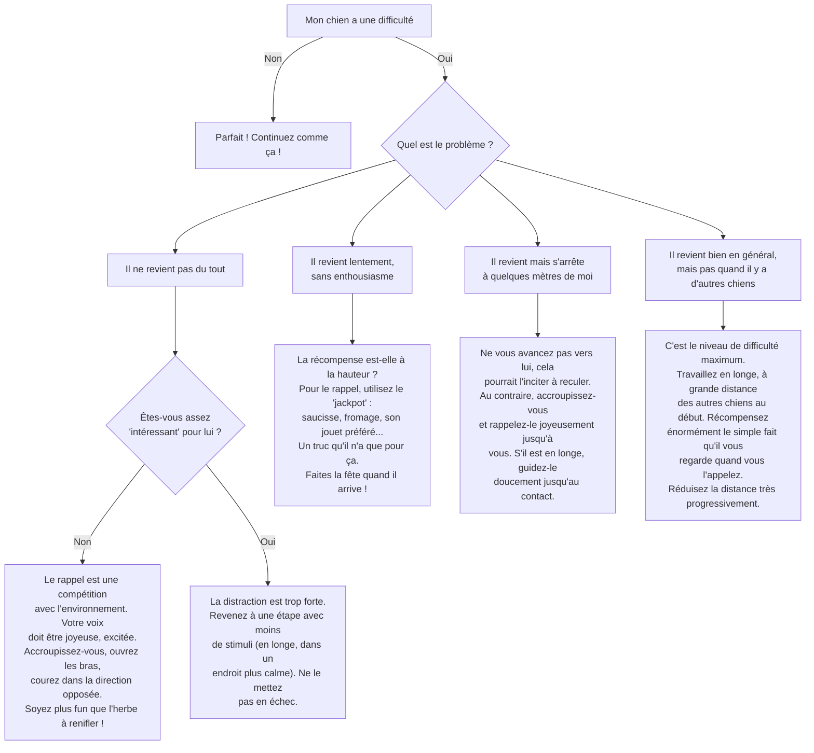

# Le Rappel : L'Ordre Vital

- **Description du Tour** : Ton chien revient vers toi dès que tu l'appelles, peu importe la situation.
- **Pourquoi l'Apprendre ?** : C'est l'ordre le plus **IMPORTANT** pour sa **sécurité** (éviter un accident) et pour sa **liberté** (le lâcher en toute confiance).
- **Prérequis** : Une bonne relation de confiance entre vous.

## Apprentissage Étape par Étape

### Niveau 1 : À la maison, au calme

1.  Commence dans un endroit **très calme** (une pièce fermée).
2.  Accroupis-toi, ouvre grand les bras et, d'une voix **ultra joyeuse et excitée**, appelle-le : « **Viens !** » ou « **Ici !** » (ou son nom).
3.  Dès qu'il arrive, fais-en des tonnes ! Félicite-le (« **OUIII, BRAVO !** ») et donne-lui une **super friandise** (un truc qu'il adore).
4.  Répète souvent, fais-en un jeu génial.

### Niveau 2 : Dans le jardin

1.  Entraîne-toi dans le jardin ou un lieu clôturé.
2.  Augmente progressivement la distance (5-10 mètres).
3.  Introduis de très légères distractions (un jouet par terre, un peu plus loin).
4.  Récompense **toujours** avec une super friandise et un max d'enthousiasme.

### Niveau 3 : En extérieur avec une longe

1.  Utilise une **longe** (laisse de 5-10 mètres) dans un parc peu fréquenté.
2.  Appelle-le quand il est un peu distrait (en train de renifler une odeur).
3.  S'il ne revient pas, utilise la longe pour le guider **doucement** vers toi, puis récompense-le quand il arrive.
4.  Ne tire jamais d'un coup sec.

### Niveau 4 : Le test ultime

1.  Entraîne-toi dans des lieux de plus en plus stimulants (parc avec d'autres chiens, des gens, etc.), d'abord en longe, puis, quand c'est parfait, sans laisse.

## Arbre de Décision : Que faire si... ?

Voici un guide pour vous aider à résoudre les problèmes courants lors de l'apprentissage de ce tour.

- **Quand l'Exercice est-il Maîtrisé ?** : Le rappel est un travail de **toute une vie**. Il n'est jamais acquis à 100%.
- **Conseil du Coach** : Règle d'or : ne **JAMAIS** gronder ton chien quand il revient (même s'il a mis du temps). Tu dois être sa "zone de sécurité". Le rappel doit **TOUJOURS** être associé à quelque chose de positif. Sinon, il n'aura aucune raison de revenir. 
