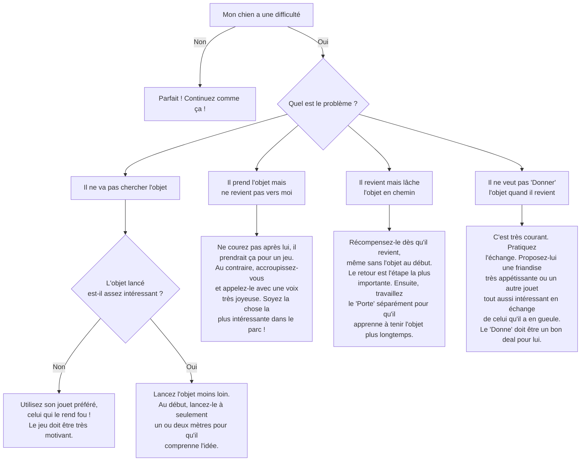

# "Rapporte" l'objet

- **Description du Tour** : Ton chien va chercher un objet que tu as lancé et te le ramène.
- **Pourquoi l'Apprendre ?** : Un super jeu interactif qui **dépense son énergie** et renforce votre **collaboration**.
- **Prérequis** : Ton chien doit aimer jouer avec des objets.

## Apprentissage Étape par Étape

### Niveau 1 : Le début du jeu

1.  Lance un jouet qu'il **adore** à courte distance.
2.  Dès qu'il le prend en gueule, dis « **Bravo !** ».
3.  Quand il revient vers toi avec l'objet, dis « **Donne** » et présente une **friandise** en échange pour qu'il lâche.
4.  Récompense-le et relance le jouet pour continuer.

### Niveau 2 : On introduit l'ordre

1.  Introduis le mot « **Rapporte** » juste avant de lancer l'objet.
2.  Augmente un peu la distance de lancer.
3.  Entraîne-toi dans le jardin.

### Niveau 3 : On complique

1.  Lance l'objet plus loin.
2.  Entraîne-toi avec de légères distractions (un autre jouet par terre, par exemple).
3.  Commence à varier les objets à rapporter.

### Niveau 4 : Le rapport expert

1.  Entraîne-toi dans des endroits variés (parc, forêt).
2.  Demande-lui de rapporter des objets plus éloignés ou même un peu cachés.

## Arbre de Décision : Que faire si... ?

Voici un guide pour vous aider à résoudre les problèmes courants lors de l'apprentissage de ce tour.

- **Quand l'Exercice est-il Maîtrisé ?** : Ton chien va chercher l'objet, te le ramène et le lâche dans ta main de manière **fiable** (9 fois sur 10) sur l'ordre « Rapporte », même avec des distractions.
- **Conseil du Coach** : Au début, félicite-le **toujours** quand il lâche l'objet, même s'il ne le met pas directement dans ta main. L'important, c'est qu'il associe le retour vers toi à quelque chose de positif. 
