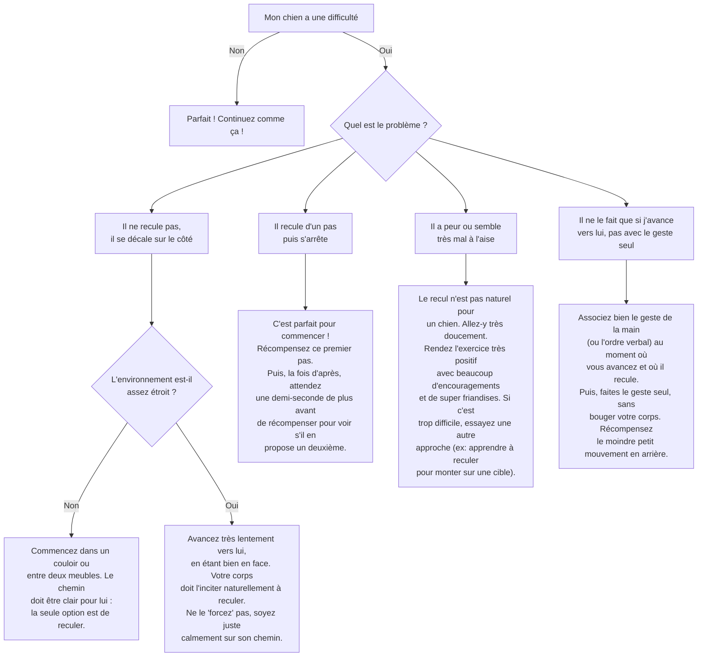

# L'ordre "Recule"

- **Description du Tour** : Ton chien recule de quelques pas quand tu le lui demandes.
- **Pourquoi l'Apprendre ?** : Utile pour la **gestion de l'espace**, par exemple pour le faire reculer d'une porte ou d'un passage étroit sans le toucher.
- **Prérequis** : Aucun.

## Apprentissage Étape par Étape

### Niveau 1 : L'incitation naturelle

1.  Mets-toi face à ton chien dans un couloir ou un espace étroit.
2.  Avance **lentement** vers lui en disant « **Recule** » et en faisant un petit pas en avant. Il devrait reculer naturellement pour ne pas te rentrer dedans.
3.  Dès qu'il fait un pas en arrière, dis « **Bravo !** » et donne une friandise.

### Niveau 2 : On ajoute le geste

1.  Introduis un geste de la main (main ouverte qui pousse en arrière) avec l'ordre « **Recule** ».
2.  Augmente le nombre de pas en arrière (2-3 pas).

### Niveau 3 : On prend de l'espace

1.  Augmente la distance de recul (3-5 pas).
2.  Entraîne-toi dans un espace plus ouvert.
3.  Entraîne-toi avec de légères distractions.

### Niveau 4 : On généralise

1.  Entraîne-toi dans différents endroits.
2.  Demande-lui de reculer sur une plus longue distance.

## Arbre de Décision : Que faire si... ?

Voici un guide pour vous aider à résoudre les problèmes courants lors de l'apprentissage de ce tour.

- **Quand l'Exercice est-il Maîtrisé ?** : Ton chien recule de plusieurs pas **immédiatement** et de manière **fiable** (9 fois sur 10) sur ordre verbal ou gestuel, sans contact physique, même avec des distractions.
- **Conseil du Coach** : Sois **patient**. Certains chiens ne sont pas du tout à l'aise avec le fait de reculer. C'est un mouvement qui n'est pas naturel pour eux. Vas-y en douceur. 
