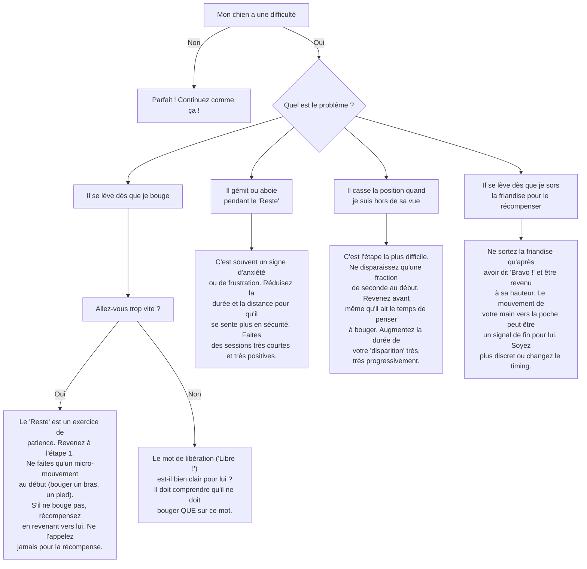

# "Reste" / "Pas Bouger"

- **Description du Tour** : Ton chien maintient une position (assis, couché, debout) jusqu'à ce que tu le libères.
- **Pourquoi l'Apprendre ?** : **Crucial** pour la **sécurité** (attendre à la porte, ne pas foncer vers un danger) et pour le contrôle en général.
- **Prérequis** : Maîtrise des ordres « **Assis** » et « **Couché** ».

## Apprentissage Étape par Étape

### Niveau 1 : La base (durée et distance minimales)

1.  Demande à ton chien de s'asseoir ou de se coucher.
2.  Dis « **Reste** » (ou « Pas bouger »).
3.  Fais un **tout petit** pas en arrière, puis reviens immédiatement. S'il n'a pas bougé, dis « **Bravo !** » et donne une friandise.
4.  Répète, en augmentant **très légèrement** la distance et la durée (1-2 secondes max).
5.  Introduis un mot de libération (« **Libre !** », « Ok ! ») pour marquer la fin de l'exercice.

### Niveau 2 : On augmente un peu

1.  Augmente la distance à 2-3 pas.
2.  Augmente la durée à 5 secondes.
3.  Entraîne-toi dans une autre pièce.
4.  Introduis de légères distractions (tu bouges un objet près de toi).

### Niveau 3 : On se cache

1.  Augmente la distance (5-10 pas) et la durée (10-20 secondes).
2.  Tourne-lui le dos, puis disparais brièvement de sa vue (derrière un meuble).
3.  Entraîne-toi avec des distractions modérées (un membre de la famille qui passe dans la pièce).

### Niveau 4 : Le test ultime en extérieur

1.  Entraîne-toi dehors, dans des lieux de plus en plus stimulants (parc, rue).
2.  Augmente la distance et la durée de ton "absence".
3.  Introduis des distractions importantes (d'autres chiens, des bruits forts).

## Arbre de Décision : Que faire si... ?

Voici un guide pour vous aider à résoudre les problèmes courants lors de l'apprentissage de ce tour.

- **Quand l'Exercice est-il Maîtrisé ?** : Ton chien tient la position demandée de manière **fiable** (9 fois sur 10) pendant plusieurs minutes et à distance, même avec des distractions, jusqu'à ce que tu le libères.
- **Conseil du Coach** : Si ton chien bouge avant ton signal, **surtout ne le gronde pas**. Ramène-le calmement à sa place et reprends l'exercice à l'étape d'avant, en plus facile. La clé, c'est de ne jamais le mettre en échec. 
