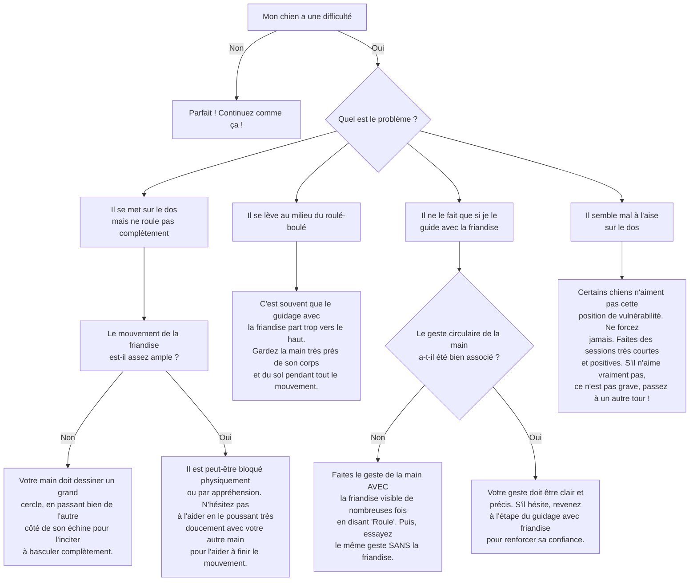

# "Roule" / "Roule-boulé"

- **Description du Tour** : Ton chien, une fois allongé, se tourne complètement sur lui-même.
- **Pourquoi l'Apprendre ?** : Un tour **amusant** qui travaille sa **souplesse** et sa **coordination**.
- **Prérequis** : Maîtrise de l'ordre « **Couché** ».

## Apprentissage Étape par Étape

### Niveau 1 : Le guidage complet

1.  Demande à ton chien de se coucher.
2.  Tiens une **friandise** près de son museau. Déplace-la **lentement** en arc de cercle au-dessus de sa tête et le long de son dos pour l'inciter à rouler sur le flanc, puis sur le dos, et enfin sur l'autre flanc.
3.  Dès que la roulade est complète, dis « **Bravo !** » et donne la friandise.

### Niveau 2 : On introduit l'ordre

1.  Introduis le mot « **Roule** » juste avant de le guider avec la friandise.
2.  Réduis un peu le guidage, laisse-le initier le mouvement.
3.  Entraîne-toi dans une autre pièce.

### Niveau 3 : On passe au geste

1.  Utilise un **geste** de la main (un cercle) pour guider, au lieu de la friandise.
2.  Entraîne-toi avec de légères distractions.

### Niveau 4 : On perfectionne

1.  Entraîne-toi dans différents endroits.
2.  Demande le tour avec un geste minimal ou juste l'ordre verbal.

## Arbre de Décision : Que faire si... ?

Voici un guide pour vous aider à résoudre les problèmes courants lors de l'apprentissage de ce tour.

- **Quand l'Exercice est-il Maîtrisé ?** : Ton chien fait une roulade complète **immédiatement** et de manière **fiable** (9 fois sur 10) sur ordre verbal ou gestuel, sans guidage, même avec des distractions.
- **Conseil du Coach** : S'il hésite, n'hésite pas à le guider **doucement** avec ton autre main pour l'aider à basculer. Le contact physique peut le rassurer et lui faire comprendre le mouvement. 
