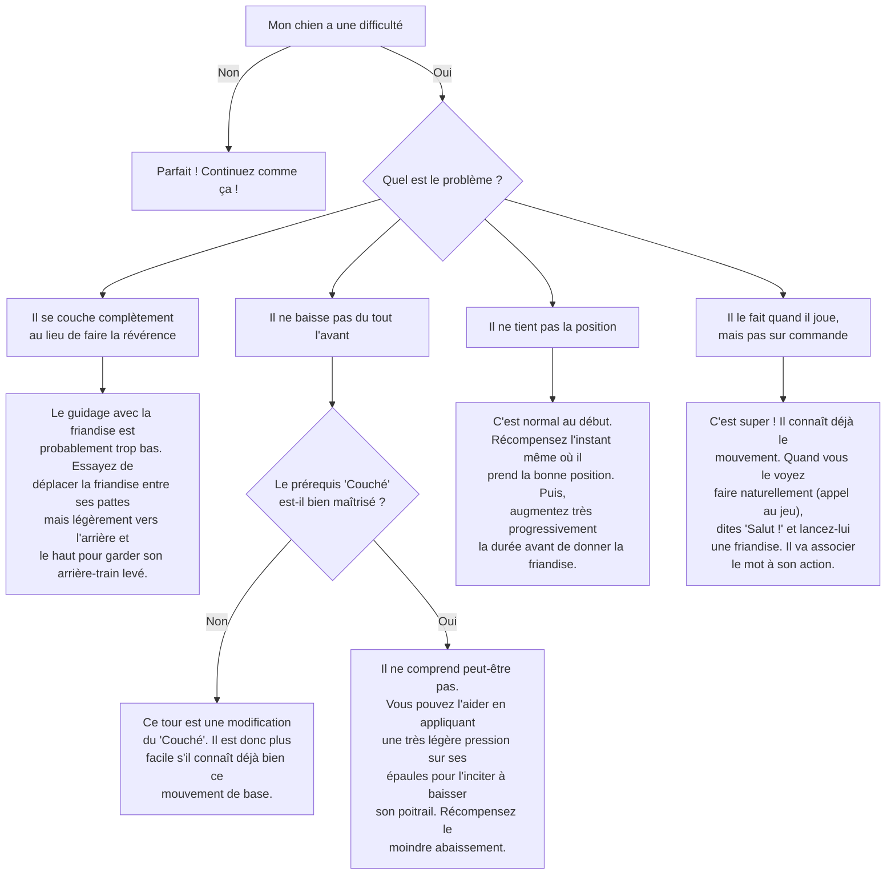

# Le "Salut" / La Révérence

- **Description du Tour** : Ton chien baisse son poitrail au sol tout en gardant son arrière-train en l'air. C'est sa façon de dire "On joue ?".
- **Pourquoi l'Apprendre ?** : Un tour **mignon** qui imite un comportement canin naturel et renforce sa **coordination**.
- **Prérequis** : Maîtrise de l'ordre « **Couché** ».

## Apprentissage Étape par Étape

### Niveau 1 : Le guidage

1.  Demande à ton chien de se coucher.
2.  Tiens une **friandise** près de son museau. Déplace-la légèrement vers l'arrière, entre ses pattes avant, tout en le poussant **doucement** sur ses épaules pour l'inciter à baisser son poitrail.
3.  Dès qu'il prend la position, dis « **Bravo !** » et donne la friandise.

### Niveau 2 : On introduit l'ordre

1.  Introduis le mot « **Salut** » (ou « Révérence ») juste avant de le guider.
2.  Réduis le guidage physique.

### Niveau 3 : On passe au geste

1.  Utilise un **geste** de la main (main ouverte qui va vers le bas) pour l'inciter à faire le mouvement.
2.  Entraîne-toi avec de légères distractions.

### Niveau 4 : On généralise

1.  Entraîne-toi dans différents endroits.
2.  Demande-lui le tour à distance.

## Arbre de Décision : Que faire si... ?

Voici un guide pour vous aider à résoudre les problèmes courants lors de l'apprentissage de ce tour.

- **Quand l'Exercice est-il Maîtrisé ?** : Ton chien fait la révérence **immédiatement** et de manière **fiable** (9 fois sur 10) sur ordre verbal ou gestuel, sans aide physique, même avec des distractions.
- **Conseil du Coach** : Ce mouvement est **naturel** pour les chiens (c'est un appel au jeu), ce qui peut rendre l'apprentissage plus facile. Observe-le bien, il le fait peut-être déjà ! 
