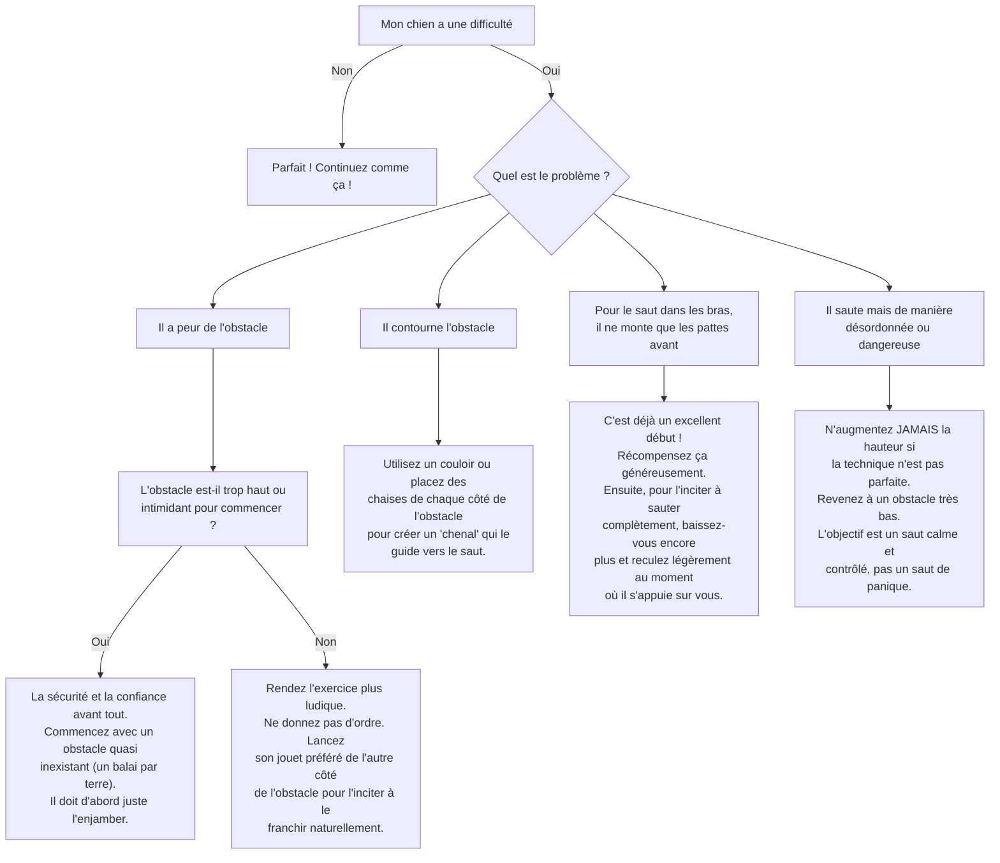

# L'ordre "Saute"

- **Description du Tour** : Ton chien saute par-dessus un petit obstacle ou dans tes bras.
- **Pourquoi l'Apprendre ?** : Un tour **dynamique** qui développe son **agilité** et sa **confiance** en lui.
- **Prérequis** : Une bonne condition physique. Ne pas faire ce tour avec un chiot dont la croissance n'est pas terminée.

## Apprentissage Étape par Étape

### Niveau 1 : Le petit obstacle

1.  Commence avec un obstacle **très bas** (ta jambe par terre, un livre).
2.  Tiens une **friandise** de l'autre côté de l'obstacle et incite ton chien à passer par-dessus.
3.  Dès qu'il saute, dis « **Bravo !** » et donne la friandise.
4.  **Pour sauter dans les bras** : accroupis-toi et incite-le à sauter. Récompense-le dès qu'il met ses pattes avant sur tes épaules.

### Niveau 2 : On introduit l'ordre

1.  Introduis le mot « **Saute** » juste avant le mouvement.
2.  Augmente **un tout petit peu** la hauteur de l'obstacle.

### Niveau 3 : On monte (un peu)

1.  Augmente la hauteur de l'obstacle **progressivement**. Ne va jamais trop haut, la sécurité avant tout.
2.  Entraîne-toi avec de légères distractions.

### Niveau 4 : On enchaîne

1.  Entraîne-toi dans différents endroits.
2.  Demande-lui de sauter par-dessus plusieurs petits obstacles à la suite.

## Arbre de Décision : Que faire si... ?

Voici un guide pour vous aider à résoudre les problèmes courants lors de l'apprentissage de ce tour.

- **Quand l'Exercice est-il Maîtrisé ?** : Ton chien saute par-dessus l'obstacle ou dans tes bras **immédiatement** et de manière **fiable** (9 fois sur 10) sur ordre verbal ou gestuel, sans guidage, même avec des distractions.
- **Conseil du Coach** : **Adapte toujours** la hauteur de l'obstacle à la taille et aux capacités de ton chien. **PROTEGE SES ARTICULATIONS** : évite les sauts à répétition, surtout pour les chiots ou les chiens âgés. 
