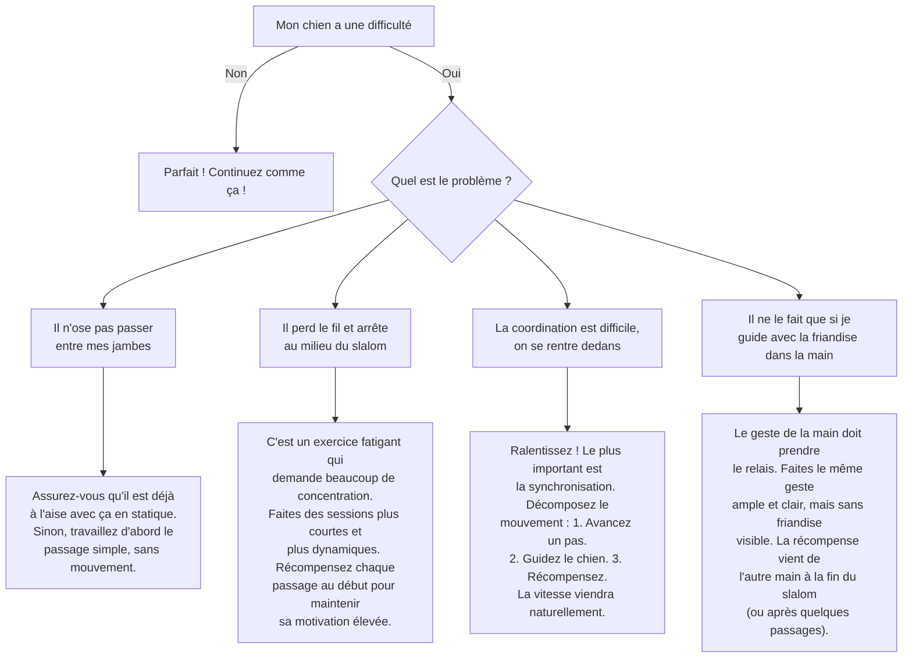

# Le "Slalom" entre les jambes

- **Description du Tour** : Ton chien passe en faisant des "huit" entre tes jambes pendant que tu avances.
- **Pourquoi l'Apprendre ?** : Un tour **dynamique** qui améliore sa **coordination**, sa **concentration** et votre **complicité** en mouvement.
- **Prérequis** : Ton chien doit être à l'aise à l'idée de passer entre tes jambes.

## Apprentissage Étape par Étape

### Niveau 1 : Le guidage pas à pas

1.  Tiens une **friandise**. Mets ton chien devant toi.
2.  Avance une jambe (la droite, par exemple) et guide ton chien avec la friandise pour qu'il passe entre tes jambes.
3.  Dès qu'il est passé, dis « **Bravo !** » et donne la friandise.
4.  Avance l'autre jambe (la gauche) et guide-le pour qu'il passe de l'autre côté.

### Niveau 2 : On introduit l'ordre

1.  Introduis le mot « **Slalom** » (ou « Entre ») juste avant de commencer.
2.  Réduis le guidage avec la friandise, utilise juste un geste de la main.
3.  Enchaîne quelques "huit".

### Niveau 3 : On accélère un peu

1.  Augmente le nombre de "huit" à la suite.
2.  Marche un peu plus vite.
3.  Entraîne-toi avec de légères distractions.

### Niveau 4 : On fluidifie

1.  Entraîne-toi dans différents endroits.
2.  Augmente la **vitesse** et la **fluidité** du mouvement.
3.  Introduis des distractions plus importantes.

## Arbre de Décision : Que faire si... ?

Voici un guide pour vous aider à résoudre les problèmes courants lors de l'apprentissage de ce tour.

- **Quand l'Exercice est-il Maîtrisé ?** : Ton chien slalome de manière **fluide** et **fiable** (9 fois sur 10) entre tes jambes quand tu marches, sur ordre verbal ou gestuel, sans guidage, même avec des distractions.
- **Conseil du Coach** : Fais-en un jeu ! Rends le mouvement **fluide** et **amusant**. Ton énergie est communicative, alors félicite-le beaucoup pour qu'il reste motivé. 
