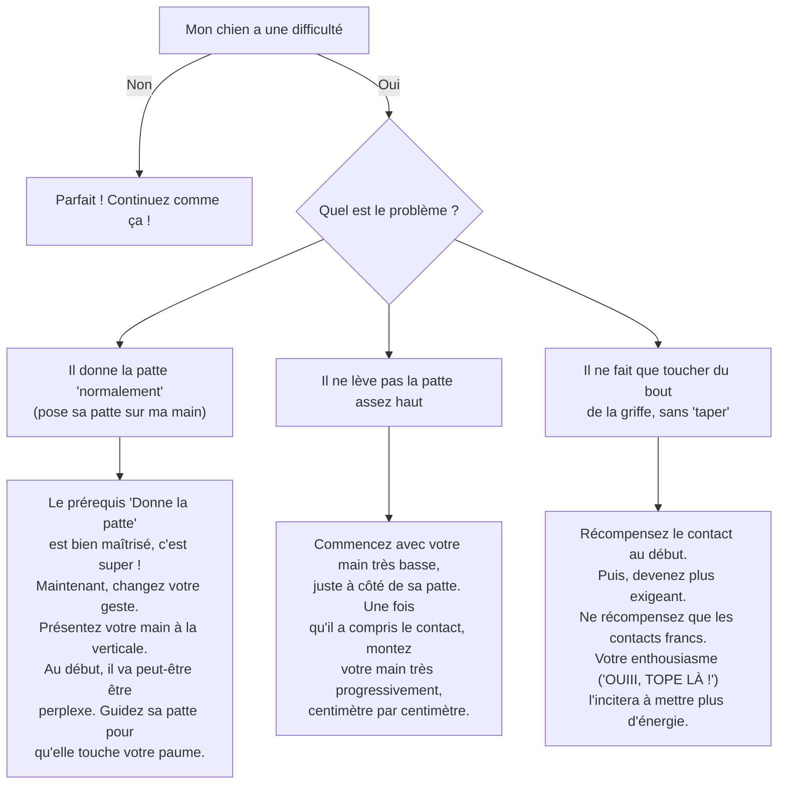

# "Tope LÀ !"

- **Description du Tour** : Ton chien lève sa patte pour taper dans ta main tendue verticalement.
- **Pourquoi l'Apprendre ?** : Une variante **amusante** de « Donne la patte » qui renforce votre **interaction**.
- **Prérequis** : Maîtrise de l'ordre « **Donne la patte** ».

## Apprentissage Étape par Étape

### Niveau 1 : Le guidage

1.  Demande à ton chien de s'asseoir.
2.  Tends ta main à la verticale, paume ouverte, et dis « **Tope là !** ».
3.  S'il ne touche pas, guide **doucement** sa patte avec ton autre main pour qu'elle touche ta paume.
4.  Dès que sa patte touche ta main, dis « **Bravo !** » et donne une friandise.

### Niveau 2 : On retire l'aide

1.  Demande « **Tope là !** » sans le guider physiquement.
2.  Augmente un peu la distance de ta main.

### Niveau 3 : On prend de la distance

1.  Augmente progressivement la distance de ta main.
2.  Entraîne-toi avec de légères distractions.

### Niveau 4 : On varie les plaisirs

1.  Entraîne-toi dans différents endroits.
2.  Demande-lui le « Tope là ! » à différentes hauteurs (plus haut, plus bas).

## Arbre de Décision : Que faire si... ?

Voici un guide pour vous aider à résoudre les problèmes courants lors de l'apprentissage de ce tour.

- **Quand l'Exercice est-il Maîtrisé ?** : Ton chien lève sa patte et touche ta main **immédiatement** et de manière **fiable** (9 fois sur 10) sur l'ordre « Tope là ! », sans guidage, à différentes hauteurs et même avec des distractions.
- **Conseil du Coach** : Mets-y de **l'enthousiasme** ! C'est un jeu. Tes félicitations et ton énergie sont ses meilleures récompenses. 
