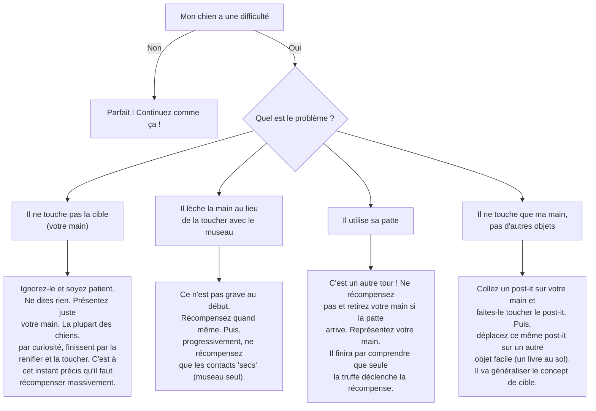

# "Touche" (une cible)

- **Description du Tour** : Ton chien touche une cible (ta main, un objet) avec son museau.
- **Pourquoi l'Apprendre ?** : C'est la **base** de très nombreux tours plus complexes (allumer la lumière, fermer une porte) et un super moyen de canaliser son énergie.
- **Prérequis** : Aucun.

## Apprentissage Étape par Étape

### Niveau 1 : Le premier contact

1.  Présente ta main ouverte (paume vers ton chien).
2.  Par curiosité, il va la toucher avec son museau. À l'instant précis où il le fait, dis « **Bravo !** » et donne une friandise.
3.  Introduis le mot « **Touche** ».

### Niveau 2 : On varie les cibles

1.  Demande « **Touche** » en variant la position de ta main (plus haut, plus bas, sur les côtés).
2.  Introduis un objet simple comme nouvelle cible (un livre, un post-it).

### Niveau 3 : On prend de la distance

1.  Augmente la distance à laquelle ton chien doit aller pour toucher la cible.
2.  Entraîne-toi avec de légères distractions.

### Niveau 4 : On généralise

1.  Entraîne-toi dans différents endroits.
2.  Varie les cibles et leurs positions.

## Arbre de Décision : Que faire si... ?

Voici un guide pour vous aider à résoudre les problèmes courants lors de l'apprentissage de ce tour.

- **Quand l'Exercice est-il Maîtrisé ?** : Ton chien touche la cible que tu lui indiques avec son museau, **immédiatement** et de manière **fiable** (9 fois sur 10), sur ordre verbal ou gestuel, à distance et même avec des distractions.
- **Conseil du Coach** : Le « Touche » est une commande **fondamentale**. Elle t'ouvrira les portes pour apprendre des tours beaucoup plus complexes et pour travailler à distance avec ton chien. 
