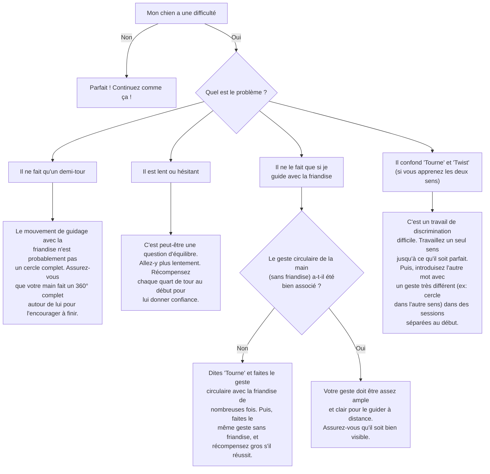

# "Tourne" sur lui-même

- **Description du Tour** : Ton chien fait un tour complet sur lui-même.
- **Pourquoi l'Apprendre ?** : Un tour **ludique** qui stimule son **agilité** et sa **coordination**.
- **Prérequis** : Aucun.

## Apprentissage Étape par Étape

### Niveau 1 : Le guidage

1.  Tiens une **friandise** près du museau de ton chien.
2.  Déplace ta main en faisant un grand cercle autour de sa tête, pour l'inciter à suivre la friandise et à tourner.
3.  Dès qu'il a fait un tour complet, dis « **Bravo !** » et donne la friandise.

### Niveau 2 : On introduit l'ordre et le geste

1.  Introduis le mot « **Tourne** » (ou « Twist ») juste avant de le guider.
2.  Réduis le guidage avec la friandise, en utilisant un **geste** de la main (un cercle).

### Niveau 3 : On prend de la distance

1.  Augmente la distance à laquelle tu donnes l'ordre.
2.  Entraîne-toi avec de légères distractions.

### Niveau 4 : On perfectionne

1.  Entraîne-toi dans différents endroits.
2.  Demande le tour avec un geste minimal ou juste avec l'ordre verbal.

## Arbre de Décision : Que faire si... ?

Voici un guide pour vous aider à résoudre les problèmes courants lors de l'apprentissage de ce tour.

- **Quand l'Exercice est-il Maîtrisé ?** : Ton chien fait un tour complet **immédiatement** et de manière **fiable** (9 fois sur 10) sur ordre verbal ou gestuel, sans guidage, même avec des distractions.
- **Conseil du Coach** : Une fois qu'il maîtrise, tu peux lui apprendre à tourner dans les deux sens ! Utilise des mots différents, comme « **Tourne** » pour la droite et « **Twist** » pour la gauche, par exemple. 
